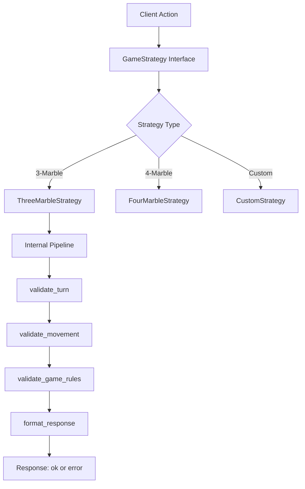
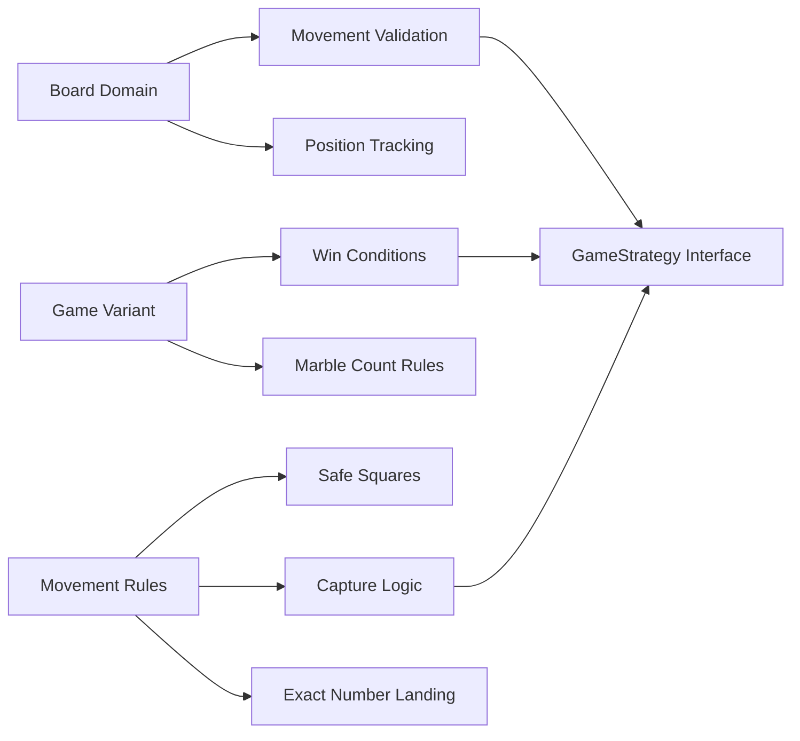
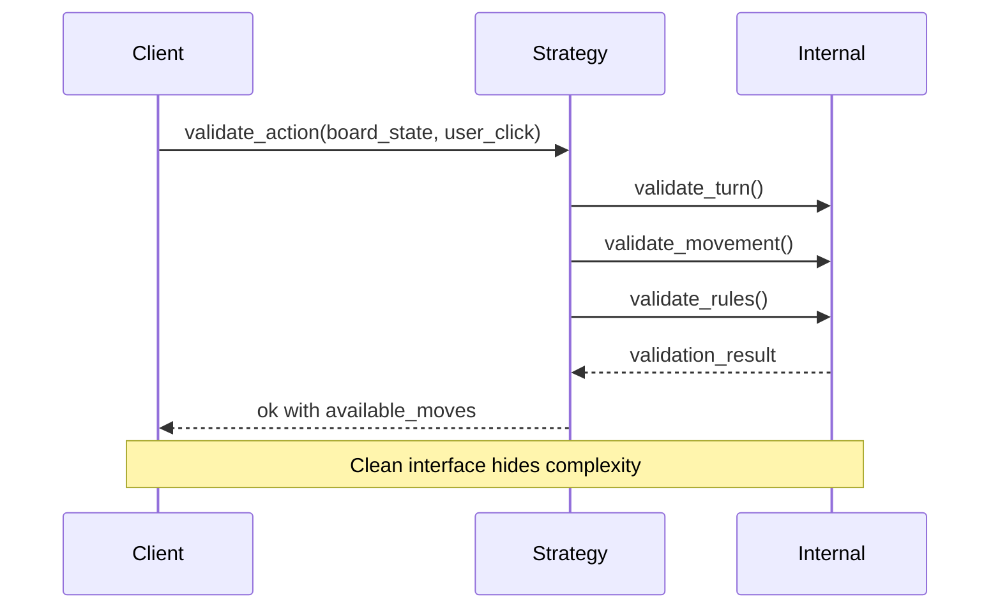

# ADR-004: Business Logic Separation

## Status
Accepted

## Context
We need to decide how to structure and organize the game rules and business logic within the `parchis_core` application. This decision affects:

- **Testability**: How easily we can test game rules in isolation
- **Maintainability**: How changes to rules impact the codebase
- **AI Development**: How clearly we can focus AI agents on specific rule sets
- **Reusability**: Potential for reusing logic across different interfaces
- **Complexity Management**: How we handle the various game phases and validations
- **Strategy Flexibility**: Supporting different game variants (3 vs 4 marbles, safe squares, etc.)

The business logic includes: board management, move validation, turn management, win conditions, marble capture rules, and user interaction validation.

## Options Considered

**Option A: Pipeline-first Validation**
- External pipeline: `user_action |> validate_turn |> validate_movement |> validate_strategy_rules`
- Exposed validation steps to consumers
- Sequential, rigid validation flow
- Consumers need to understand validation internals

**Option B: Strategy-first Interface**
- Strategy encapsulates all validation logic internally
- Clean public interface: `strategy.validate_action(board_state, user_action)`
- Internal pipeline hidden from consumers
- Contract-based design with behaviors

**Option C: Phoenix Contexts Pattern**
- Organize logic into Phoenix contexts (Games, Players, Moves)
- Database-oriented design even in pure logic layer
- Heavier abstraction for pure functional code

**Option D: Domain-Driven Design (DDD) Style**
- Aggregates, entities, and value objects
- Rich domain models with encapsulated behavior
- Object-oriented approach in functional language

## Learning Resources for Decision
- **Phoenix Contexts**: "Programming Phoenix 1.4" Chapter 10 (Chris McCord)
- **Functional Design**: "Functional Web Development with Elixir, OTP, and Phoenix" (Lance Halvorsen)
- **Domain Modeling**: "Domain Modeling Made Functional" (Scott Wlaschin)
- **Elixir Patterns**: "Designing Elixir Systems with OTP" (James Edward Gray II)
- **Strategy Pattern**: "Design Patterns in Elixir" (Elvio Vicosa)

## Decision
**Choose Option B: Strategy-first Interface with Internal Pipeline**

## Rationale
1. **Clean Interface Contracts**: Stable public API regardless of internal implementation changes
2. **Strategy Flexibility**: Easy to implement different game variants (3 vs 4 marbles, safe squares)
3. **AI Agent Clarity**: Simple, consistent interface for AI development
4. **Encapsulation**: Internal validation complexity hidden from consumers
5. **Testability**: Mock entire strategy or test individual components
6. **Pragmatic Scope**: Focus on 3-marble variant without safe squares initially

## Architecture Design



## Implementation Strategy

### Public Interface Layer
```elixir
@behaviour GameStrategy

# Clean public contract - same for all strategies
def validate_action(board_state, user_action)
def get_available_moves(board_state, player_id, dice_value)
def apply_move(board_state, validated_move)
def check_win_condition(board_state)
```

### Internal Implementation Layer
```elixir
# Hidden pipeline within strategy module
def validate_action(board_state, user_action) do
  user_action
  |> validate_turn(board_state)
  |> validate_movement(board_state)  
  |> validate_strategy_rules(board_state)
  |> format_response()
end

# Strategy-specific internal functions
defp validate_strategy_rules(action, %{strategy: :three_marble} = board_state)
defp validate_strategy_rules(action, %{strategy: :four_marble} = board_state)
```

## Domain Separation



## Initial Scope Strategy: ThreeMarbleBasic
- **3 marbles per player**
- **No safe squares**
- **Finish pockets with exact numbers**
- **Cannot jump own marbles**
- **Standard capture rules**
- **Visual highlighting for available moves**

## Consequences

**Positive:**
- Clean separation between public interface and internal complexity
- Easy to add new game variants without breaking existing code
- AI agents work with consistent interface regardless of strategy
- Internal pipeline can evolve independently
- Strategy-specific optimizations possible

**Negative:**
- Initial abstraction overhead for single variant
- Behavior definitions require more upfront design
- Potential over-engineering for simple rule sets

**Mitigation:**
- Start with single strategy (ThreeMarbleBasic) and extract interface organically
- Use pragmatic approach - add complexity only when needed
- Focus on clear boundaries rather than premature optimization

## Interface Evolution Plan



## Compliance
This decision supports Modern Software Engineering principles:
- **Fast Feedback**: Clear interfaces enable focused testing
- **Build Quality In**: Strategy pattern ensures consistent behavior contracts
- **Focus on Outcomes**: Serves both single variant and future extensibility needs
